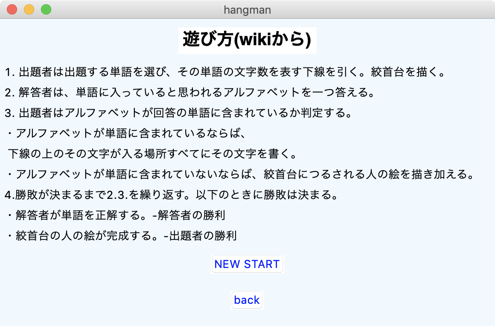
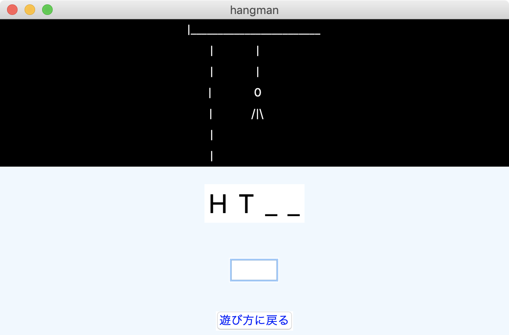
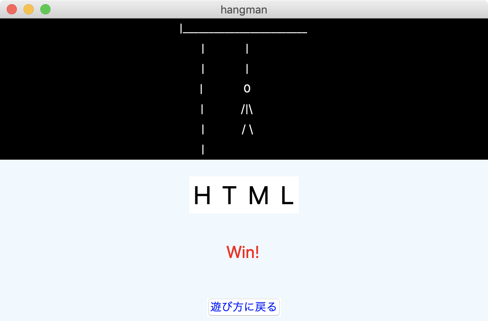

# Hangman GUI Game

hangman game についてGUIで遊ぶゲームです。

## Description

ゲーム内容に関しては、START画面（[ハングマン (ゲーム)](https://ja.wikipedia.org/wiki/%E3%83%8F%E3%83%B3%E3%82%B0%E3%83%9E%E3%83%B3_(%E3%82%B2%E3%83%BC%E3%83%A0))）に記載のある通り、ランダムに設定されたアルファベットのの単語を予想し、その単語に含むと思われるアルファベット1文字を入力します。
正解ならば、解答のアルファベットが表示され、不正解ならhangmanの絵が一部描写されます。
hangmanの絵が完成する前に、解答を当てるゲームです

## Use
「NEW START」を押すとGame画面に移動するので、入力ボックスにアルファベットを入力します。

## Requirement（動作環境）
- macOS Mojave
- Python 3.0以上

## Purpose
- GUI ライブラリの学習
- オブジェクト指向の書き方の学習

## Reference
[独学プログラマー Python言語の基本から仕事のやり方まで](https://www.amazon.co.jp/dp/B07BKVP9QY/ref=dp-kindle-redirect?_encoding=UTF8&btkr=1)
